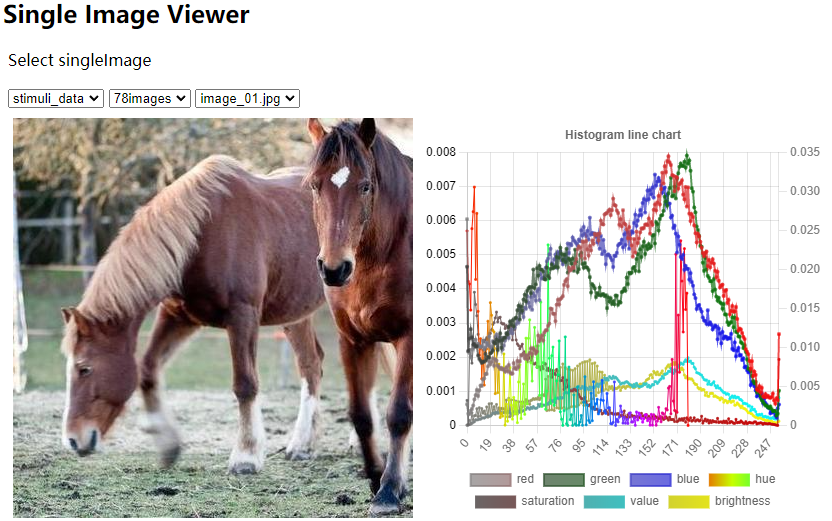
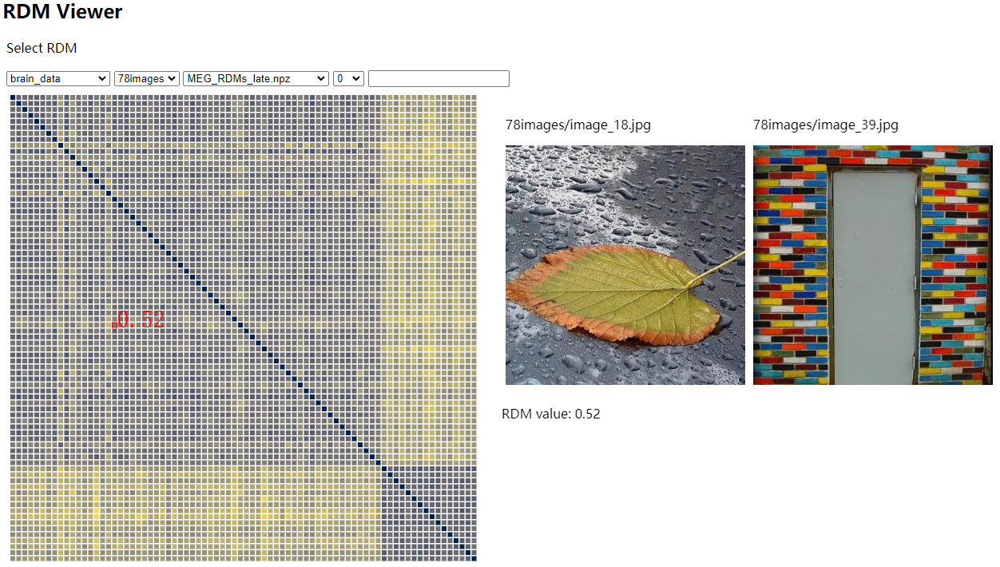
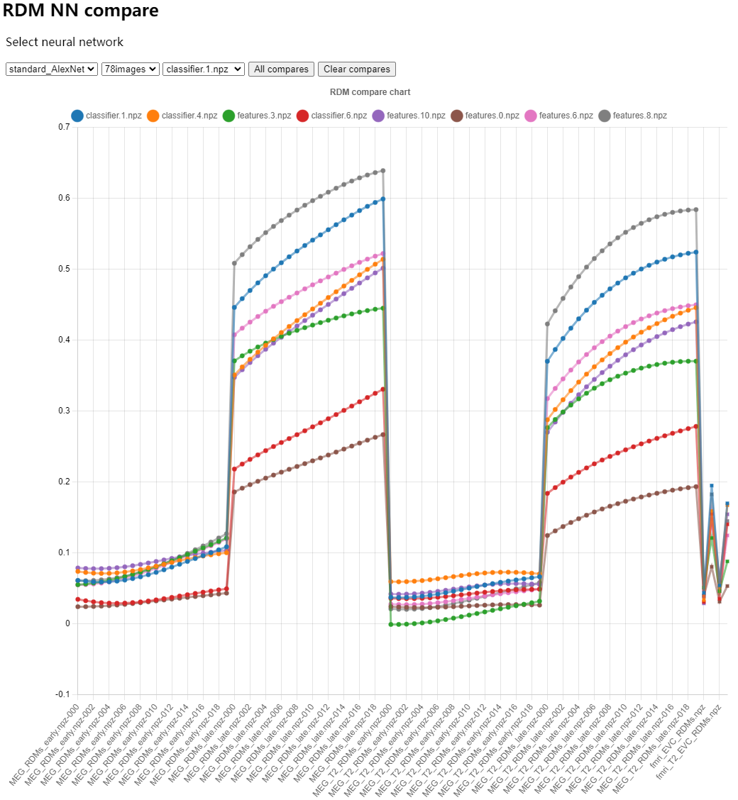
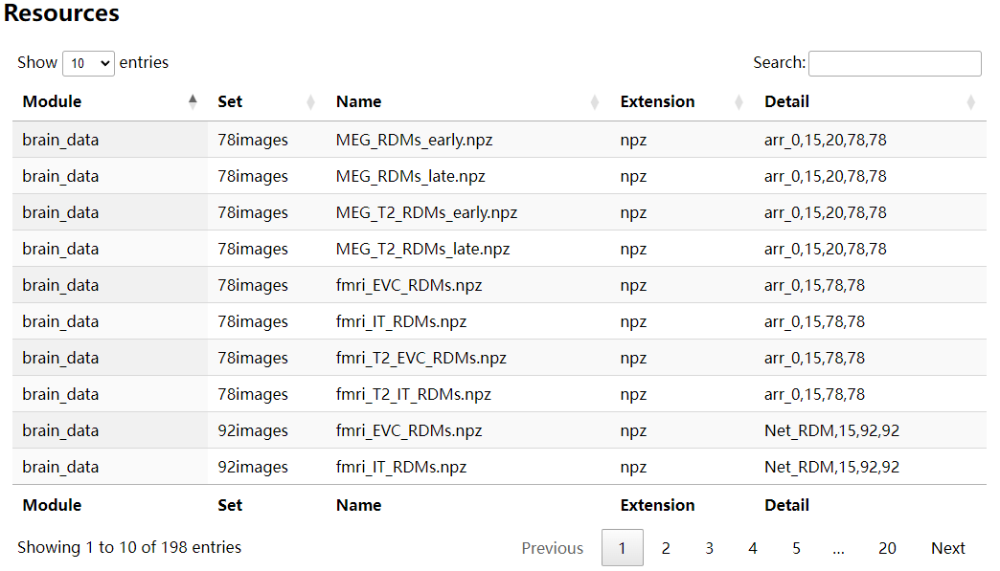

# RDM computation and compare

---

## Before you do anything

Setup the variables

```sh
#!/bin/bash
# Load the configuration
source .profile
```

or set the variables in [.env](./env) to make it works in VSCode development.

---

It is a django-based online workshop with 3 functions.

1. Gallary single image with its histogram;
2. Display RDM matrix comparing the distance between each two images,
   the RDM matrix is computed from neural imaging data from fMRI and MEG.
   Thus it represents the brain's activity to the images.
3. Compare the layers' activation of the Neural Network with the brain's activity,
   the value refers the similarity between the NN and brain.

## Single Image Viewer



## RDM Viewer



## RDM NN Compare



## Resources

